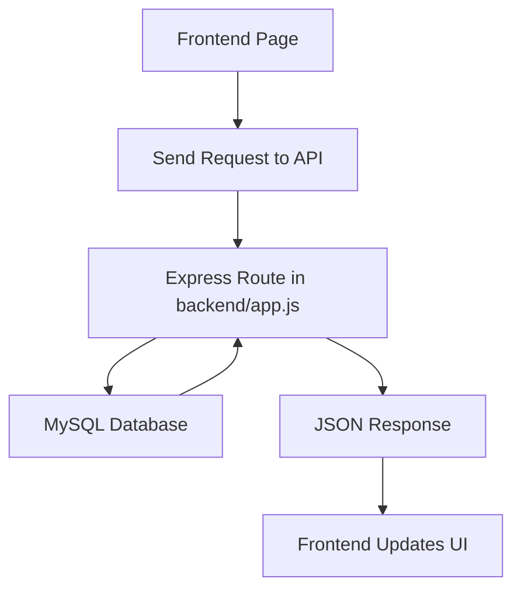
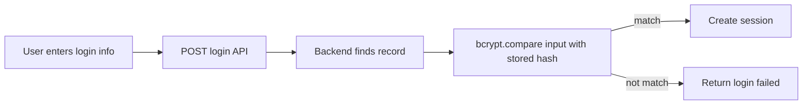
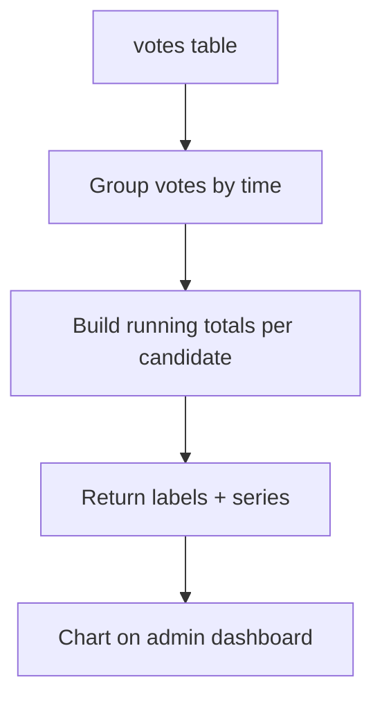
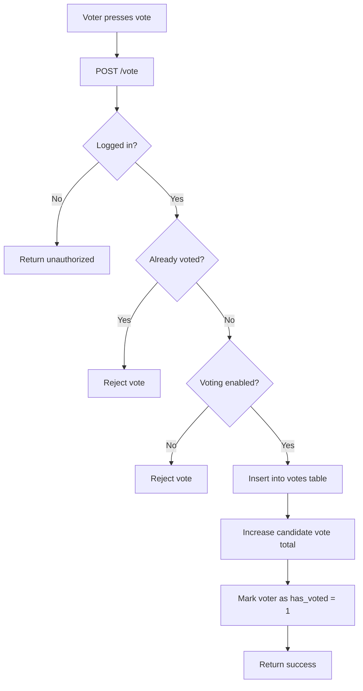

# MFU Election API Explain

This file explains the API used in the `MFU election` project in a beginner-friendly way.

The backend is built with:

- `Node.js`
- `Express`
- `MySQL`
- `express-session`
- `bcrypt`

The API is mostly used by 3 user types:

- `Voter`
- `Candidate`
- `Admin`

---

## 1. Big Picture

The system flow is:



In simple words:

1. A page like `login.html` or `admin-dashboard.html` sends a request.
2. The backend route receives that request.
3. The route reads or updates the database.
4. The backend sends data back as JSON.
5. The frontend shows the result.

---

## 2. Security / Auth Design

The project uses **session-based authentication**.

After a successful login:

- the backend stores the user in `req.session.user`
- later API routes check that session
- this is how the system knows whether the current user is a voter, candidate, or admin

### Current secret storage

Sensitive values are now stored as **bcrypt hashes**:

- `voters.laser_id`
- `candidates.password`
- `admins.password`

That means:

- the database does **not** keep the original plain text value
- login works by comparing the input with the stored hash using `bcrypt.compare()`

### Auth flow graph



---

## 3. Main API Groups

The backend API can be understood in 6 groups:

1. Login / Logout
2. Public election data
3. Voter APIs
4. Admin APIs
5. Candidate APIs
6. Voting API

---

## 4. Login / Logout APIs

### `POST /login/voter`

Purpose:

- logs in a voter using `citizen_id` and `laser_id`

How it works:

- finds voter by `citizen_id`
- checks `status = 1`
- compares input `laser_id` with hashed `laser_id` in database
- if correct, creates voter session

Request body:

```json
{
  "citizen_id": "6731501001",
  "laser_id": "GY22884001"
}
```

Success response:

```json
{
  "success": true
}
```

Fail response:

```json
{
  "success": false,
  "message": "Invalid voter login"
}
```

---

### `POST /login/candidate`

Purpose:

- logs in a candidate

Important note:

- candidate can log in using either:
  - `candidate_id`
  - `email`

How it works:

- checks candidate by identifier
- checks `status = 1`
- compares password with hashed DB password
- creates candidate session if correct

Request body:

```json
{
  "identifier": "1",
  "password": "SiriSecure!26"
}
```

or

```json
{
  "identifier": "thitipong@mfu.ac.th",
  "password": "SiriSecure!26"
}
```

---

### `POST /login/admin`

Purpose:

- logs in an admin

How it works:

- finds admin by username
- compares password with hashed admin password
- creates admin session

Request body:

```json
{
  "username": "admin",
  "password": "admin123"
}
```

---

### `POST /logout`

Purpose:

- destroys current session

Response:

```json
{
  "success": true
}
```

---

## 5. Public Election Data APIs

These are used to show candidate info and results.

### `GET /candidates`

Purpose:

- returns all **active** candidates

Used by:

- voter dashboard
- export
- candidate selection UI

Returns:

- `candidate_id`
- `name`
- `party`
- `position`
- `policy`
- `image_url`
- `votes`

---

### `GET /results`

Purpose:

- returns ranking/result data for all candidates

Used by:

- results page
- admin lead standings

Returns:

- candidate basic info
- `vision`
- `manifesto`
- `image_url`
- total vote count using `COUNT(v.vote_id)`

---

### `GET /candidates/:id`

Purpose:

- returns one candidate profile by candidate ID

Used by:

- public candidate profile page

---

## 6. Voter APIs

These routes only work when a voter session exists.

### `GET /voter/history`

Purpose:

- returns the logged-in voter’s vote history

What it returns:

- vote record list
- summary data

Response structure:

```json
{
  "success": true,
  "history": [],
  "summary": {
    "total_votes": 1,
    "participation_rate": 100,
    "active_eligibility": 0
  }
}
```

---

### `GET /votes/recent`

Purpose:

- returns recent vote activity / recent leading candidates for voter dashboard

Rules:

- voter session required
- supports query parameter `limit`

Example:

`/votes/recent?limit=6`

---

## 7. Dashboard Summary API

### `GET /dashboard`

Purpose:

- returns summary numbers for logged-in users

Current values:

- total voters
- total candidates
- total votes
- voting enabled status
- turnout percentage

Response example:

```json
{
  "voters": 52,
  "candidates": 7,
  "votes": 1,
  "voting_enabled": 1,
  "percentage": "1.92"
}
```

---

## 8. Admin APIs

These routes are mainly used by `admin-dashboard.html`.

### `GET /admin/voters`

Purpose:

- returns all voters for admin table

Returns:

- `voter_id`
- `citizen_id`
- `laser_id` (hashed value now)
- `status`
- `has_voted`

Important:

- because `laser_id` is now hashed, it should be treated as secured data, not a readable real card value

---

### `POST /admin/toggle-voter`

Purpose:

- enables or disables a voter

Request body:

```json
{
  "voter_id": 12,
  "status": 0
}
```

Meaning:

- `status: 1` = enabled
- `status: 0` = disabled

---

### `POST /admin/register-voter`

Purpose:

- creates a new voter account

Important behavior:

- hashes `laser_id` before saving
- new voter starts with:
  - `status = 0`
  - `has_voted = 0`

Request body:

```json
{
  "citizen_id": "6731501999",
  "laser_id": "GY22889999"
}
```

---

### `POST /admin/register-candidate`

Purpose:

- creates a candidate from admin dashboard

Important behavior:

- hashes candidate password before saving
- new candidate starts with `status = 0`

Request body:

```json
{
  "name": "New Candidate",
  "email": "new@mfu.ac.th",
  "party": "Student Voice",
  "position": "President",
  "password": "MyPassword123",
  "image_url": "https://example.com/photo.jpg",
  "vision": "My vision",
  "manifesto": "My manifesto"
}
```

---

### `GET /admin/candidates`

Purpose:

- returns candidate list for admin table

Returns:

- `candidate_id`
- `name`
- `policy`
- `status`

---

### `GET /admin/candidates/:id/detail`

Purpose:

- returns admin-only candidate detail

Used by:

- `candidate-profile-admin.html`

Returns:

- full candidate profile
- current vote count
- status

---

### `GET /admin/vote-performance`

Purpose:

- returns chart data for admin voting performance graph

What it returns:

- `labels`: timestamps
- `series`: cumulative vote totals per candidate

Used by:

- admin dashboard graph

Graph data flow:



---

### `POST /admin/toggle-candidate`

Purpose:

- enables or disables a candidate

Request body:

```json
{
  "candidate_id": 2,
  "status": 1
}
```

---

### `POST /admin/toggle-voting`

Purpose:

- opens or closes the whole election

Request body:

```json
{
  "enabled": 0
}
```

Meaning:

- `1` = voting open
- `0` = voting closed

---

## 9. Candidate APIs

### `POST /candidate/register`

Purpose:

- public candidate registration request

Important behavior:

- candidate password is hashed before saving
- candidate starts disabled

Used by:

- `register-candidate.html`

---

### `POST /candidate/update`

Purpose:

- candidate updates own profile content

Candidate can update:

- `name`
- `policy`
- `vision`
- `manifesto`

Session required:

- candidate login

---

### `GET /candidate/profile`

Purpose:

- gets profile of the currently logged-in candidate

Used by:

- candidate dashboard

---

### `GET /candidate/dashboard`

Purpose:

- gets candidate dashboard analytics and profile summary

Used by:

- candidate dashboard page

Returns data like:

- candidate info
- vote count
- performance data
- chart summary

---

## 10. Voting API

### `POST /vote`

Purpose:

- records a voter’s vote

How it works:

1. checks voter session
2. checks whether voter has already voted
3. checks whether election is open
4. verifies candidate exists
5. inserts vote into `votes`
6. updates `candidates.votes`
7. updates `voters.has_voted = 1`

Request body:

```json
{
  "candidate_id": 1
}
```

Response example:

```json
{
  "success": true,
  "vote_id": 10,
  "candidate_id": 1
}
```

Vote flow:



---

## 11. Session Rules by Role

The backend uses these session types:

### Voter session

```js
req.session.user = {
  type: 'voter',
  voter_id: 12
}
```

### Candidate session

```js
req.session.user = {
  type: 'candidate',
  candidate_id: 3
}
```

### Admin session

```js
req.session.user = {
  type: 'admin',
  admin_id: 1
}
```

These values are checked in protected APIs.

---

## 12. Database Tables Used by the API

### `voters`

Stores:

- citizen ID
- hashed laser ID
- enabled/disabled status
- whether the voter has already voted

### `candidates`

Stores:

- candidate info
- hashed password
- campaign text
- image
- enabled/disabled status
- cached vote count

### `votes`

Stores:

- who voted
- which candidate received the vote
- vote timestamp

### `admins`

Stores:

- admin username
- hashed admin password

### `settings`

Stores:

- election status like `voting_enabled`

---

## 13. Simple API Map

```mermaid
flowchart TD
    A[Frontend]
    A --> B[Login APIs]
    A --> C[Public Data APIs]
    A --> D[Voter APIs]
    A --> E[Admin APIs]
    A --> F[Candidate APIs]
    A --> G[Vote API]

    B --> B1[/login/voter]
    B --> B2[/login/candidate]
    B --> B3[/login/admin]
    B --> B4[/logout]

    C --> C1[/candidates]
    C --> C2[/results]
    C --> C3[/candidates/:id]

    D --> D1[/voter/history]
    D --> D2[/votes/recent]

    E --> E1[/dashboard]
    E --> E2[/admin/voters]
    E --> E3[/admin/register-voter]
    E --> E4[/admin/register-candidate]
    E --> E5[/admin/candidates]
    E --> E6[/admin/candidates/:id/detail]
    E --> E7[/admin/vote-performance]
    E --> E8[/admin/toggle-voter]
    E --> E9[/admin/toggle-candidate]
    E --> E10[/admin/toggle-voting]

    F --> F1[/candidate/register]
    F --> F2[/candidate/update]
    F --> F3[/candidate/profile]
    F --> F4[/candidate/dashboard]

    G --> G1[/vote]
```

---

## 14. Important Beginner Notes

### Why some routes use `GET` and others use `POST`

- `GET` is usually for reading data
- `POST` is usually for creating, updating, or changing data

### Why hashing matters

If passwords or laser IDs are stored in plain text:

- anyone with DB access can read them
- it is a security risk

Hashing solves that by storing an irreversible secure value instead.

### Why session checks matter

Without session checks:

- voter could call admin routes
- candidate could call protected routes they should not access

That is why many routes first check:

```js
if (!req.session.user || req.session.user.type !== 'admin')
```

---

## 15. Suggested Improvement Notes

These are not required for understanding, but useful:

- add middleware like `requireAdmin`, `requireVoter`, `requireCandidate`
- move routes into separate files instead of one large `app.js`
- use transactions in `/vote`
- stop storing duplicate vote totals in both `votes` and `candidates.votes`
- mask hashed values in admin UI instead of showing them directly

---

## 16. File Reference

Most API code is inside:

- [backend/app.js](/Applications/XAMPP/xamppfiles/htdocs/mfu-election/backend/app.js)

Database setup and seed logic:

- [backend/setup.js](/Applications/XAMPP/xamppfiles/htdocs/mfu-election/backend/setup.js)

Frontend pages that use the API include:

- [frontend/login.html](/Applications/XAMPP/xamppfiles/htdocs/mfu-election/frontend/login.html)
- [frontend/admin-dashboard.html](/Applications/XAMPP/xamppfiles/htdocs/mfu-election/frontend/admin-dashboard.html)
- [frontend/candidate-dashboard.html](/Applications/XAMPP/xamppfiles/htdocs/mfu-election/frontend/candidate-dashboard.html)
- [frontend/register-candidate.html](/Applications/XAMPP/xamppfiles/htdocs/mfu-election/frontend/register-candidate.html)

