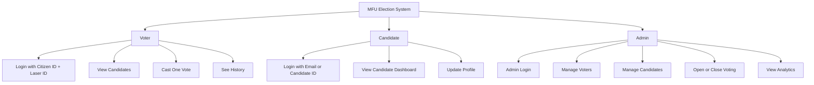
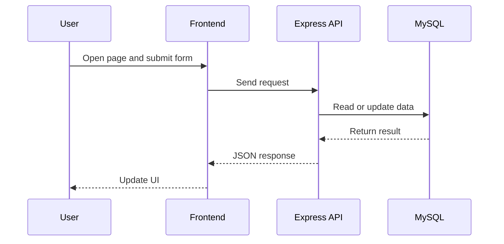
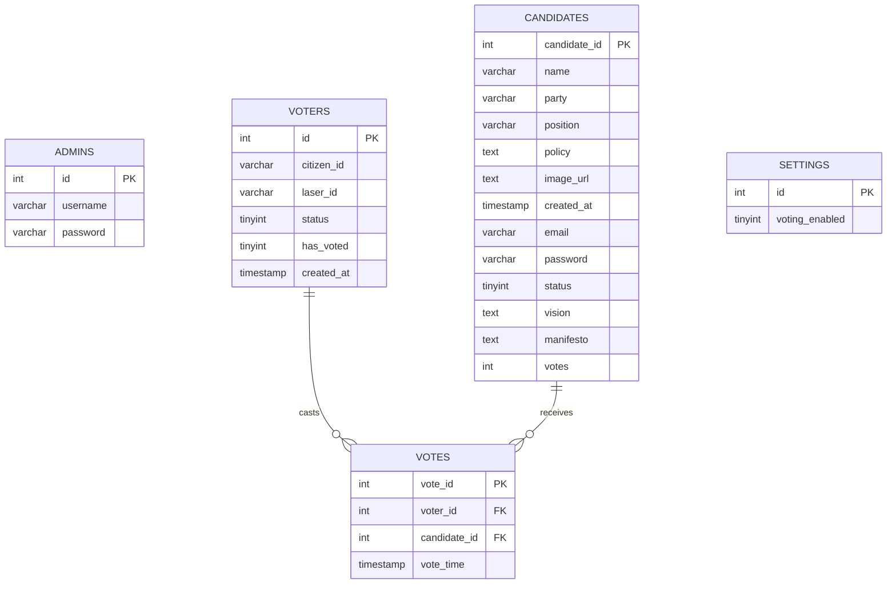

# MFU Election

Minimal guide to understand the whole project fast.

## What This Project Is

MFU Election is a university election web app with 3 user roles:

- `Voter`
- `Candidate`
- `Admin`

It includes:

- login and session-based authentication
- candidate profiles and dashboards
- one-person-one-vote election flow
- admin control panel for voters, candidates, and voting status
- MySQL database with seeded demo data

## Project Flow


## User Roles



## Main Tech Stack

- `Node.js`
- `Express`
- `MySQL / MariaDB`
- `mysql2`
- `express-session`
- `bcrypt`
- `HTML`
- `CSS`
- `Vanilla JavaScript`

## Folder Map

```text
mfu-election/
├── backend/
│   ├── app.js
│   ├── db.js
│   └── setup.js
├── frontend/
│   ├── login.html
│   ├── admin-dashboard.html
│   ├── candidate-profile-admin.html
│   └── public/
│       ├── css/
│       └── js/
├── APIExplain.md
├── SETUP.md
├── credentials.txt
└── database-schema.txt
```

## Core Files

- [backend/app.js](/Applications/XAMPP/xamppfiles/htdocs/mfu-election/backend/app.js)
  Main API server and route logic.
- [backend/db.js](/Applications/XAMPP/xamppfiles/htdocs/mfu-election/backend/db.js)
  MySQL connection.
- [backend/setup.js](/Applications/XAMPP/xamppfiles/htdocs/mfu-election/backend/setup.js)
  Creates tables and inserts demo data.
- [frontend/admin-dashboard.html](/Applications/XAMPP/xamppfiles/htdocs/mfu-election/frontend/admin-dashboard.html)
  Admin UI.
- [frontend/public/css/admin-dashboard.css](/Applications/XAMPP/xamppfiles/htdocs/mfu-election/frontend/public/css/admin-dashboard.css)
  Admin responsive styles for laptop, iPad, and phone.
- [APIExplain.md](/Applications/XAMPP/xamppfiles/htdocs/mfu-election/APIExplain.md)
  Beginner-friendly API explanation.
- [database-schema.txt](/Applications/XAMPP/xamppfiles/htdocs/mfu-election/database-schema.txt)
  Paste-ready SQL database script.

## Main System Flow



## Authentication Design

- `Voter` logs in with `citizen_id` + `laser_id`
- `Candidate` logs in with `email` or `candidate_id` + `password`
- `Admin` logs in with `username` + `password`
- sessions are stored with `express-session`
- sensitive values are hashed with `bcrypt`

Hashed database fields:

- `voters.laser_id`
- `candidates.password`
- `admins.password`

## Database Tables



## Main Features

- `Voter`
  Voter login, candidate browsing, vote casting, vote history.
- `Candidate`
  Candidate login, profile page, dashboard, profile update.
- `Admin`
  Admin login, analytics, lead standings, voter registration, candidate registration, user management, enable/disable actions.
- `Responsive UI`
  Laptop, iPad, and phone-specific admin dashboard behavior.

## Main API Groups

- login and logout
- public candidate and result data
- voter dashboard and history
- candidate profile and dashboard
- admin dashboard and management
- voting actions

For the full API route explanation, read [APIExplain.md](/Applications/XAMPP/xamppfiles/htdocs/mfu-election/APIExplain.md).

## Important Pages

- `frontend/login.html`
  Main login portal.
- `frontend/admin-dashboard.html`
  Admin control center.
- `frontend/candidate-profile-admin.html`
  Admin-only candidate profile review page.

## Quick Start

1. Install backend packages.

```bash
cd /Applications/XAMPP/xamppfiles/htdocs/mfu-election/backend
npm install
```

2. Make sure MySQL is running in XAMPP.

3. Create the database.

Option A:
Run setup script:

```bash
cd /Applications/XAMPP/xamppfiles/htdocs/mfu-election/backend
node setup.js
```

Option B:
Paste [database-schema.txt](/Applications/XAMPP/xamppfiles/htdocs/mfu-election/database-schema.txt) into phpMyAdmin SQL tab.

4. Start the backend server.

```bash
cd /Applications/XAMPP/xamppfiles/htdocs/mfu-election/backend
node app.js
```

5. Open:

- `http://localhost:3000/login.html`

## Demo Credentials

See [credentials.txt](/Applications/XAMPP/xamppfiles/htdocs/mfu-election/credentials.txt) for the full list.

Main ones:

- `Admin`
  `admin / admin123`
- `Candidate`
  `thitipong@mfu.ac.th / SiriSecure!26`
- `Voter`
  use one seeded `citizen_id` and matching `laser_id`

## Beginner Notes

- `status = 1` means enabled
- `status = 0` means disabled
- `has_voted = 1` means the voter already voted
- `settings.voting_enabled = 1` means the election is open
- `votes` table stores the actual ballot records

## If You Want To Read More

- [APIExplain.md](/Applications/XAMPP/xamppfiles/htdocs/mfu-election/APIExplain.md)
  Full API explanation in simple language.
- [SETUP.md](/Applications/XAMPP/xamppfiles/htdocs/mfu-election/SETUP.md)
  Setup instructions.
- [database-schema.txt](/Applications/XAMPP/xamppfiles/htdocs/mfu-election/database-schema.txt)
  Full SQL schema and seed data.

## Short Summary

This project is a full election system:

- frontend pages send requests
- Express handles the logic
- MySQL stores the data
- sessions manage login state
- bcrypt protects secrets
- admin controls the whole election from one dashboard
